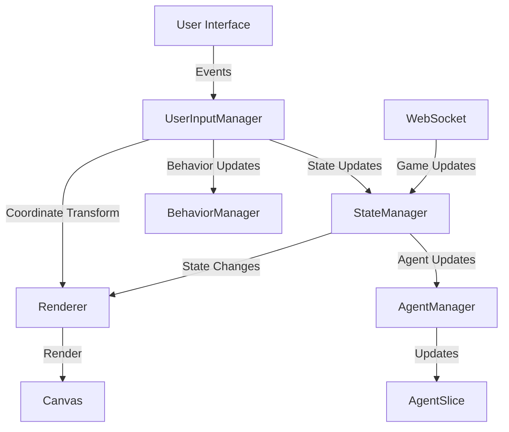

# Game Architecture Documentation: Event-Driven Frontend

## Overview

The frontend game architecture implements an event-driven model with a centralized state management system. It follows a modular approach with clear separation of concerns through specialized managers and slices.

## Core Components

### UserInputManager

Central component for handling all user interactions and translating them into game state changes.

#### Responsibilities
- Handles mouse, touch, and keyboard events
- Manages agent selection and dragging
- Controls viewport manipulation (zoom, pan)
- Updates behavior parameters through UI controls
- Interfaces with Renderer for coordinate transformations

#### Input State Management
```typescript
interface InputState {
    isDragging: boolean;
    dragStartPosition: Position | null;
    mousePosition: Position;
    lastTouchDistance: number | null;
    isEnabled: boolean;
}
```

#### Key Operations
- Agent selection and movement
- Camera control through mouse/touch
- Behavior parameter adjustments
- Keyboard shortcuts handling
- Touch gesture processing

#### Integration Points
- Coordinates with StateManager for state updates
- Works with Renderer for coordinate transformations
- Updates UI elements for behavior controls
- Manages game canvas interactions

### StateManager

The central orchestrator for application state, managing the interaction between all specialized managers and handling state transitions.

#### Responsibilities
- Acts as the central state coordinator
- Delegates operations to specialized managers
- Maintains subscription system for state changes
- Handles WebSocket message updates
- Manages game running state and connection status

#### State Management
```typescript
interface GameState {
  isRunning: boolean;
  connectionStatus: 'connected' | 'disconnected' | 'error';
  config: GameConfig | null;
  selectedAgent: Agent | null;
  agents: Agent[];
  world: WorldState | null;
}
```

### AgentManager

Handles all agent-related operations and state management.

#### Responsibilities
- Normalizes incoming agent data from WebSocket
- Maintains agent list and selected agent state
- Updates agent positions and behaviors
- Manages team statistics
- Notifies subscribers of agent changes

#### Data Flow
```typescript
WebSocket Message → StateManager → AgentManager → AgentSlice → UI Components
```

### AgentSlice

Internal storage and logic layer for agent data.

#### Features
- Maintains list of active agents
- Handles partial agent updates
- Tracks team statistics
- Provides efficient data access methods
- Ensures data consistency

### Game Loop Integration

The game loop manages rendering and state updates.

#### Components
- Game class: Main game loop and state coordination
- Renderer: Handles all rendering operations
- InputManager: Processes user input

#### Update Cycle
```
Game Loop
├─► Process Input
├─► Update State
│   ├─► Update Agents
│   ├─► Update World
│   └─► Update Combat
└─► Render Frame
```

### Rendering System

Multi-layered rendering system with specialized renderers.

#### Components
- BaseRenderer: Core rendering functionality
- AgentRenderer: Agent-specific rendering
- WorldRenderer: World and environment rendering
- DebugRenderer: Debug information display

### State Synchronization

#### WebSocket Updates
```typescript
interface GameUpdate {
  type: 'game_update';
  data: {
    agents: {
      agents: { [key: string]: Agent };
      bounds: number[];
    };
    behaviors: {
      behaviors: { [key: string]: string };
      timers: { [key: string]: number };
      awareness: { [key: string]: any };
    };
    combat: {
      stats: any;
      dead_agents: string[];
      recent_kills: any[];
    };
    is_running: boolean;
    team_counts: {
      red: number;
      blue: number;
    };
    world: WorldState;
  };
}
```

### Event Flow Examples

#### User Input Flow
```
User Interaction
  ├─► Mouse/Touch Events
  │   ├─► UserInputManager.handleMouseMove/handleTouchMove
  │   │   ├─► Update mouse position
  │   │   ├─► Handle agent dragging
  │   │   └─► Update UI displays
  │   │
  │   ├─► UserInputManager.handleMouseDown/handleTouchStart
  │   │   ├─► Agent selection
  │   │   ├─► Start dragging
  │   │   └─► Update StateManager
  │   │
  │   └─► UserInputManager.handleWheel/handlePinchZoom
  │       ├─► Camera control
  │       └─► Viewport updates
  │
  └─► Keyboard Events
      ├─► Agent deletion
      ├─► Selection clearing
      └─► Camera centering

UI Control Interaction
  ├─► Behavior parameter updates
  │   ├─► UserInputManager.updateBehavior
  │   └─► StateManager.updateAgentBehavior
  │
  └─► Game control updates
      ├─► Start/Stop game
      └─► Reset view

#### Agent Update Flow
```
WebSocket Message
  → StateManager.handleGameUpdate()
    → AgentManager.updateAgents()
      → AgentSlice.setAgents()
        → UI Components Update
```

#### User Input Flow
```
User Action
  → InputManager
    → StateManager
      → Appropriate Manager
        → State Update
          → UI Update
```

### Component Interaction Diagram


## Implementation Guidelines

### State Management
1. Always use appropriate manager for domain-specific operations
2. Maintain state isolation
3. Implement proper error handling
4. Use TypeScript types for state validation

### Rendering
1. Follow the layer-based rendering approach
2. Implement proper cleanup in renderers
3. Handle canvas resize events
4. Use requestAnimationFrame for smooth rendering

### WebSocket Communication
1. Handle connection status appropriately
2. Implement message validation
3. Process updates in correct order
4. Maintain state synchronization

### Error Handling
1. Validate all incoming data
2. Handle WebSocket disconnections
3. Implement proper state recovery
4. Log critical operations

## Type Definitions

### Core Types
```typescript
interface Agent {
  id: string;
  team: 'red' | 'blue';
  position: Position;
  velocity: Vector2D;
  health: number;
  behavior: string;
  target_id?: string;
}

interface WorldState {
  walls: Wall[];
  bounds: number[];
  holes: Hole[];
  colines: any[];
}

interface GameStats {
  fps: number;
  red_agents: number;
  blue_agents: number;
  red_kills: number;
  blue_kills: number;
  total_deaths: number;
}
```

## Testing Strategy

### Unit Testing
- Test individual managers and slices
- Validate state transitions
- Test rendering components
- Verify event handling

### Integration Testing
- Test manager interactions
- Verify state synchronization
- Test WebSocket communication
- Validate game loop performance

### Performance Testing
- Test with multiple agents
- Verify render performance
- Monitor state updates
- Test WebSocket load handling